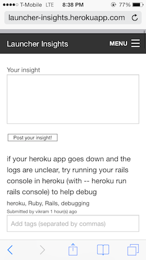
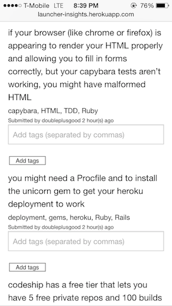

Launcher Insights allows students to share insights or discoveries they've had to enhance learning outcomes. Launchers can post insights and allow anyone to tag them, search for insights and browse insights by tags. Launcher Insights can be accessed at the following URL:

http://launcher-insights.herokuapp.com

Screenshots from Mobile:

Screenshots from Desktop:

Current features:
- Ability for user to add an insight
- Ability for any user to tag any insight
- Ability for user to search insights
- Ability to see all insights based on tags

Features to come / Todos:
- Reddit "Karma" like feature for insights to incentivize usage by students (look into acts-as-votable Gem)
- Search by tags in addition to insights
- Add ability to sign in with github
- Ability to remove insights
- Ability to remove tags
- Profile page for each user
- Admin namespacing
- Feature and Unit tests
- Convert tag list into tag cloud
- Fix sidebar so it isn't so wide
- Integration with Flowdock (so user can post insights in flows that get added to the site)
- Improved interface and UI
- Real time features
- Code refactoring

October 1, 2014:
- Skeleton version of site deployed
